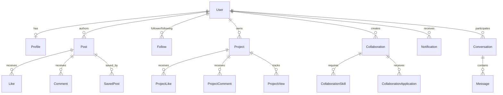

# Hive

> **Hive — Skills. Create opportunities.**

Hive is a production-ready, full-stack professional networking and career platform built for students, creators, and freelancers. It enables users to create professional identities, showcase portfolio projects, post media updates, build networks via followers/following and mutual connections, find project collaborations in a marketplace, chat directly via real-time WebSockets, receive event notifications, and manage the platform via a custom multi-role Admin Dashboard.

---

## Table of Contents

1. [Project Overview](#project-overview)
2. [Key Features](#key-features)
3. [Technology Stack](#technology-stack)
4. [System Architecture](#system-architecture)
5. [Project Structure](#project-structure)
6. [Django Applications](#django-applications)
7. [Authentication & Email OTP](#authentication--email-otp)
8. [User Profiles](#user-profiles)
9. [Network / Followers / Following](#network--followers--following)
10. [Feed & Social Posts](#feed--social-posts)
11. [Portfolio](#portfolio)
12. [Marketplace](#marketplace)
13. [Messaging](#messaging)
14. [Notifications](#notifications)
15. [Admin Dashboard](#admin-dashboard)
16. [Branding Management](#branding-management)
17. [Security](#security)
18. [Database Architecture](#database-architecture)
19. [Frontend Architecture](#frontend-architecture)
20. [JavaScript / AJAX Architecture](#javascript--ajax-architecture)
21. [Environment Variables](#environment-variables)
22. [Local Development Setup](#local-development-setup)
23. [Running Tests](#running-tests)
24. [Production / Render Deployment](#production--render-deployment)
25. [Project Status](#project-status)
26. [Future Improvements](#future-improvements)

---

## Project Overview

Hive helps users showcase real-world skills, discover talent, and collaborate on projects. Built with Django, HTML5, Tailwind CSS, JavaScript, and WebSockets (Django Channels), Hive provides a complete end-to-end environment for professional discovery and social interaction.

---

## Key Features

- **Email-Based Custom Authentication**: Unique email login with custom `User` model, role selection (`Student`, `Creator`, `Freelancer`, `Organization`, `Admin`), and 6-digit Email OTP verification.
- **Followers & Following Network**: One-way following system as the primary networking experience, supported by secondary mutual connection requests.
- **Rich Content Feed**: Create text, image, and video posts with public, connections-only, or private visibility, likes, comments, and post saving/bookmarking.
- **Portfolio Showcase**: Create and feature showcase projects with GitHub links, live demo URLs, YouTube video embeds, technologies used, view counters, project likes, and comments.
- **Project Marketplace**: Post project collaborations (`Startup`, `College Project`, `Freelance`, `Open Source`, `Personal`), define required skills, budget types (`Paid`, `Unpaid`, `Equity`, `Negotiable`), and review incoming collaboration applications.
- **Real-Time Direct Messaging**: Instant 1-on-1 conversations powered by WebSockets (Django Channels & Daphne) with normalized pair conversations (`Conversation`, `Message`) and HTTP endpoints.
- **Notification System**: In-app alerts for post likes, comments, new followers, connection events, and messages.
- **Custom Hive Admin Dashboard**: Dedicated administrative interface for user role management, account banning/suspension, content moderation, reports handling, activity logging, and branding customization (`PlatformSettings`).

---

## Technology Stack

- **Backend**: Python 3.11, Django 5.0+
- **Database**: PostgreSQL (Production) / SQLite (Development & Testing)
- **WebSockets / Async**: Django Channels 4.0+, Daphne, Celery, Redis
- **Frontend**: HTML5, Django Templates, Tailwind CSS (via CDN), Vanilla JavaScript (ES6 Fetch API)
- **Media & Static Asset Handling**: WhiteNoise (Static assets), Cloudinary / Django Storage (Media uploads)
- **Deployment**: Render (Web Service + Render PostgreSQL)

---

## System Architecture

Hive uses a modular Django design with split environment settings and an ASGI/WSGI dual server interface:

```
                  ┌─────────────────────────────────────────┐
                  │              HTTP / WS Client           │
                  └────────────────────┬────────────────────┘
                                       │
                         ┌─────────────┴─────────────┐
                         │   Daphne / Gunicorn Server│
                         └─────────────┬─────────────┘
                                       │
              ┌────────────────────────┴────────────────────────┐
              │                                                 │
   ┌──────────▼──────────┐                           ┌──────────▼──────────┐
   │ WSGI (HTTP Requests) │                           │ ASGI (WebSockets)   │
   └──────────┬──────────┘                           └──────────┬──────────┘
              │                                                 │
   ┌──────────▼──────────┐                           ┌──────────▼──────────┐
   │ Django View Layers  │                           │ Channels Consumers  │
   └──────────┬──────────┘                           └──────────┬──────────┘
              │                                                 │
              └────────────────────────┬────────────────────────┘
                                       │
                         ┌─────────────▼─────────────┐
                         │      PostgreSQL / DB      │
                         └───────────────────────────┘
```

---

## Project Structure

```
connect/
├── manage.py
├── requirements.txt
├── .env.example
├── .gitignore
├── README.md
├── build.sh
├── render.yaml
├── config/
│   ├── __init__.py
│   ├── asgi.py
│   ├── celery.py
│   ├── routing.py
│   ├── urls.py
│   ├── wsgi.py
│   └── settings/
│       ├── __init__.py
│       ├── base.py
│       ├── development.py
│       ├── production.py
│       └── test.py
├── apps/
│   ├── accounts/
│   ├── admin_dashboard/
│   ├── api/
│   ├── chat/
│   ├── common/
│   ├── connections/
│   ├── marketplace/
│   ├── notifications/
│   ├── opportunities/
│   ├── portfolio/
│   ├── posts/
│   └── profiles/
├── static/
│   ├── css/
│   └── js/
├── templates/
│   ├── accounts/
│   ├── admin_dashboard/
│   ├── base.html
│   ├── chat/
│   ├── connections/
│   ├── marketplace/
│   ├── notifications/
│   ├── portfolio/
│   ├── posts/
│   └── profiles/
└── tests/
    ├── integration/
    └── unit/
```

---

## Django Applications

- **`apps.accounts`**: Custom `User` model, registration, login/logout, OTP model (`EmailOTP`), landing auth images (`AuthLandingImage`), and password management.
- **`apps.profiles`**: `Profile`, `Education`, `Experience`, `Skill`, `UserSkill`, and `Certificate` models; profile progress calculation.
- **`apps.connections`**: `Follow` model for one-way following and `ConnectionRequest` / `Connection` for mutual connections.
- **`apps.posts`**: `Post`, `Like`, `Comment`, and `SavedPost` models for content creation and social interaction.
- **`apps.portfolio`**: `Project`, `ProjectImage`, `ProjectLike`, `ProjectComment`, `ProjectView`, and `Certificate` models.
- **`apps.marketplace`**: `Collaboration`, `CollaborationSkill`, and `CollaborationApplication` models.
- **`apps.chat`**: `Conversation` (normalized user pair) and `Message` models, WebSocket consumer handlers.
- **`apps.notifications`**: `Notification` model and signal dispatchers for automated user alerts.
- **`apps.admin_dashboard`**: `AdminProfile`, `AdminPermission`, `AdminUserPermission`, `Report`, `AdminActivityLog`, and `PlatformSettings`.
- **`apps.common`**: Abstract `TimeStampedModel` base class.
- **`apps.api`**: Lightweight JSON root endpoint (`/api/`).
- **`apps.opportunities`**: Opportunity application routing structure.

---

## Authentication & Email OTP

Hive uses email as the primary authentication field (`USERNAME_FIELD = 'email'`).

- **Account Types**: `STUDENT`, `CREATOR`, `FREELANCER`, `ORGANIZATION`, `ADMIN`.
- **OTP Flow**:
  1. On registration, `is_verified` is set to `False` and a 6-digit numeric `EmailOTP` record is generated.
  2. An email is dispatched containing the code (or printed to local console in dev).
  3. Validating the code updates `user.is_verified = True`.
  4. Includes OTP resend logic with cooldown windows and expiration checking (10 minutes).

---

## User Profiles

- **Profile Model**: Stores bio, location, website link, avatar image, cover image, and account verification badge.
- **Related Sub-Models**:
  - `Education`: Institution, degree, field of study, start/end dates.
  - `Experience`: Company, position, description, start/end dates.
  - `UserSkill`: Links `Skill` entities with user experience level and endorsement counters.
  - `Certificate`: Title, issuing organization, issue date, credential URL/ID.
- **Profile Completeness**: Auto-calculated completion percentage based on filled profile attributes.

---

## Network / Followers / Following

- **Primary System (Follow / Unfollow)**:
  - `Follow` model maintains direct follower -> following relationships.
  - Follow/unfollow actions are executed via instant AJAX requests.
  - Users can view dedicated "Followers" and "Following" list pages.
- **Secondary System (Mutual Connections)**:
  - `ConnectionRequest` model handles `PENDING`, `ACCEPTED`, `REJECTED`, or `CANCELLED` states.
  - `Connection` model stores active mutual connection pairs enforcing `user1_id < user2_id`.

---

## Feed & Social Posts

- **Post Model**: Text content, image upload (max 10MB), video upload (max 30MB), post type (`TEXT`, `IMAGE`, `VIDEO`, `PROJECT_UPDATE`, `ACHIEVEMENT`), and visibility (`PUBLIC`, `CONNECTIONS`, `PRIVATE`).
- **Interactions**:
  - **Likes**: Toggle like/unlike with real-time count update.
  - **Comments**: Write and view comments on posts.
  - **Saved Posts**: Bookmark posts to view later under saved items.

---

## Portfolio

- **Project Model**: Title, slug, short description, full description, category, project cover image, GitHub URL, live demo URL, YouTube URL (with embed generator), start/end dates, and visibility settings.
- **Featured Projects**: Users can highlight up to 3 featured projects on their main profile.
- **Engagement**: Built-in view tracking (`ProjectView`), project likes (`ProjectLike`), and project comments (`ProjectComment`).

---

## Marketplace

The Hive Marketplace focuses on project collaborations:

- **`Collaboration` Model**: Title, description, category, project type (`Startup`, `College Project`, `Freelance`, `Open Source`, `Personal`), budget type (`Paid`, `Unpaid`, `Equity`, `Negotiable`), budget amount, and duration.
- **`CollaborationSkill`**: Skills required for the project.
- **`CollaborationApplication`**: Users apply to collaborations with a custom pitch message (`PENDING`, `ACCEPTED`, `REJECTED`, `WITHDRAWN`). Creator can review, accept, or reject applicants.

---

## Messaging

- **Model Architecture**:
  - `Conversation`: Unique normalized pair (`user1_id < user2_id`) preventing duplicates.
  - `Message`: Linked to `Conversation`, tracks sender, content, timestamp, and read status (`is_read`).
- **WebSockets**: Integrated Django Channels consumer handles real-time messaging, auto-subscribing users to room groups.
- **HTTP Fallback**: Direct HTTP endpoints to fetch chat history (`/chat/conversation/<id>/`) and post new messages (`/chat/send/`).

---

## Notifications

- **Notification Model**: Stores receiver, sender, `notification_type` (`LIKE`, `COMMENT`, `FOLLOW`, `CONNECTION_REQUEST`, `CONNECTION_ACCEPTED`, `MESSAGE`, `PORTFOLIO_VIEW`, `COMMUNITY_ACTIVITY`), message text, related target URL, and `is_read` flag.
- **Signal Triggers**: Django signals automatically dispatch notifications when users interact (e.g. following someone, liking a post, sending a message).

---

## Admin Dashboard

Accessible at `/admin-dashboard/` for privileged admin roles:

- **Roles (`AdminProfile`)**: `SUPER_ADMIN`, `ADMIN_ASSISTANT`, `CONTENT_MODERATOR`, `SUPPORT_ADMIN`.
- **User Management**: Search users, toggle active status, suspend/ban users, and assign staff roles.
- **Content Moderation**: Review user-submitted `Report` items against posts/users, update report status (`PENDING`, `REVIEWING`, `RESOLVED`, `REJECTED`).
- **Activity Logging**: `AdminActivityLog` records admin actions, target objects, IP addresses, and timestamps.

---

## Branding Management

Managed through the `PlatformSettings` model in the Admin Dashboard:

- **Custom Branding**: Configurable site name (default: "Hive"), header logo upload, favicon upload, and admin panel logo upload.
- **Fallback Assets**: Template context processor (`apps.admin_dashboard.context_processors.platform_settings`) provides global access to site settings across all templates with default fallbacks.

---

## Security

Hive implements robust security controls:

- **Environment Isolation**: Secrets stored in `.env`, never hardcoded.
- **Password Protection**: Django PBKDF2 SHA256 password hashing.
- **CSRF & Injection Protection**: Mandatory CSRF tokens on all POST requests; ORM parameterized queries against SQL injection.
- **Access Control**: Object ownership validation on profile updates, post deletions, project modifications, and chat participation checks.
- **File Upload Security**: Strict file size validation (10MB image limit, 30MB video limit).
- **Production Hardening (`config.settings.production`)**:
  - `DEBUG = False`
  - `SECURE_SSL_REDIRECT = True`
  - `SESSION_COOKIE_SECURE = True`
  - `CSRF_COOKIE_SECURE = True`
  - `SECURE_HSTS_SECONDS = 31536000`
  - `SECURE_CONTENT_TYPE_NOSNIFF = True`
  - `X_FRAME_OPTIONS = 'DENY'`

---

## Database Architecture

Below is an overview of the key models and relationships in Hive:



---

## Frontend Architecture

- **Templates**: Django HTML template inheritance extending global `templates/base.html`.
- **Styling**: Tailwind CSS framework via CDN with custom utility classes.
- **Components**: Reusable template partials for navbar, sidebar, post cards, project cards, and modals.

---

## JavaScript / AJAX Architecture

Hive uses Vanilla JavaScript (ES6 Fetch API) for asynchronous page updates without page reloads:

- **Like Toggle Example**:
  ```javascript
  fetch(`/posts/${postId}/like/`, {
      method: 'POST',
      headers: {
          'X-CSRFToken': getCookie('csrftoken'),
          'X-Requested-With': 'XMLHttpRequest'
      }
  })
  .then(response => response.json())
  .then(data => {
      document.getElementById(`like-count-${postId}`).innerText = data.likes_count;
  });
  ```
- **UI Utilities**: Includes dynamic DOM manipulation, toast notifications, delete confirmation modals, and mobile drawer toggles.

---

## Environment Variables

| Variable | Purpose | Required / Optional |
|---|---|---|
| `SECRET_KEY` | Django secret cryptographic key | **Required** |
| `DEBUG` | Enables/Disables debug mode (`True`/`False`) | **Required** |
| `ALLOWED_HOSTS` | Comma-separated allowed hostnames | **Required** |
| `CSRF_TRUSTED_ORIGINS` | Trusted origins for CSRF protection | **Required in Prod** |
| `DATABASE_URL` | PostgreSQL database connection string | **Required in Prod** |
| `EMAIL_HOST` | SMTP server hostname | Optional (Default: localhost) |
| `EMAIL_PORT` | SMTP server port | Optional (Default: 587) |
| `EMAIL_HOST_USER` | SMTP authentication username | Optional |
| `EMAIL_HOST_PASSWORD` | SMTP authentication app password | Optional |
| `CELERY_BROKER_URL` | Redis URL for Celery task queue | Optional |
| `CLOUDINARY_URL` | Cloudinary storage connection string | Optional |

---

## Local Development Setup

### 1. Clone Repository & Setup Virtual Environment
```bash
git clone <repository-url>
cd connect

# Create virtual environment
python -m venv .venv

# Activate Virtual Environment:
# On Windows (PowerShell / CMD):
.venv\Scripts\activate

# On macOS / Linux:
source .venv/bin/activate
```

### 2. Install Dependencies
```bash
pip install -r requirements.txt
```

### 3. Environment Configuration
```bash
# Windows:
copy .env.example .env

# macOS / Linux:
cp .env.example .env
```

### 4. Database Migrations & Superuser
```bash
python manage.py migrate
python manage.py createsuperuser
```

### 5. Run Development Server
```bash
python manage.py runserver
```
Visit `http://127.0.0.1:8000/` in your browser.

---

## Running Tests

Run the complete Django automated test suite (114 tests) using the isolated test configuration:

```bash
python manage.py test --settings=config.settings.test
```

Run system check and migration consistency diagnostics:
```bash
python manage.py check
python manage.py makemigrations --check
```

---

## Production / Render Deployment

Hive is pre-configured for automated deployment on **Render** via `render.yaml` and `build.sh`:

```
GitHub Push ──> Render Web Service ──> Run build.sh ──> Collect Static & Migrate ──> Start Gunicorn/Daphne
                                              │
                                     Render PostgreSQL
```

### Build Command (`build.sh`)
```bash
#!/usr/bin/env bash
set -o errexit

pip install -r requirements.txt
python manage.py collectstatic --no-input
python manage.py migrate
```

### Start Command
```bash
gunicorn config.wsgi:application
```

---

## Project Status

**Hive** is a completed, production-ready full-stack Django project built as an academic and professional portfolio application. All core modules—authentication, profiles, followers, posts feed, portfolio showcase, project collaboration marketplace, WebSockets chat, notifications, and custom admin dashboard—are fully implemented and verified.

---

## Future Improvements

- Integrated video calling (WebRTC) for project collaboration.
- Advanced AI-powered skill matching for collaboration recommendations.
- OAuth2 social login integrations (GitHub, LinkedIn).
